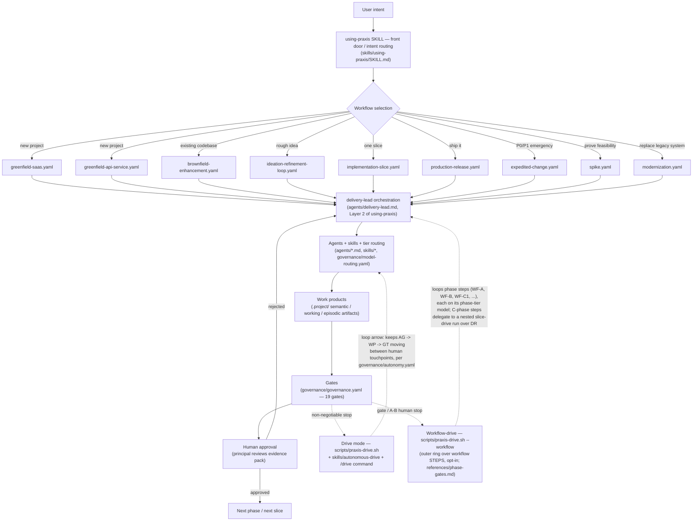
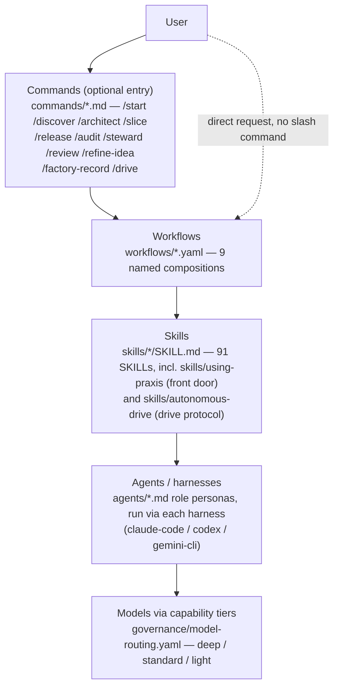
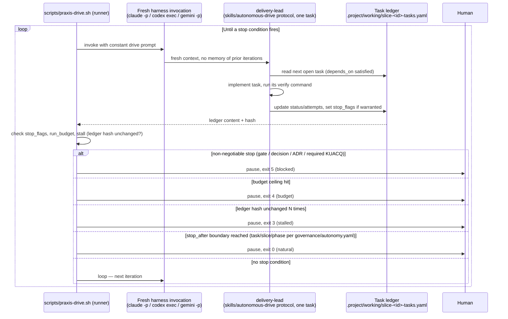
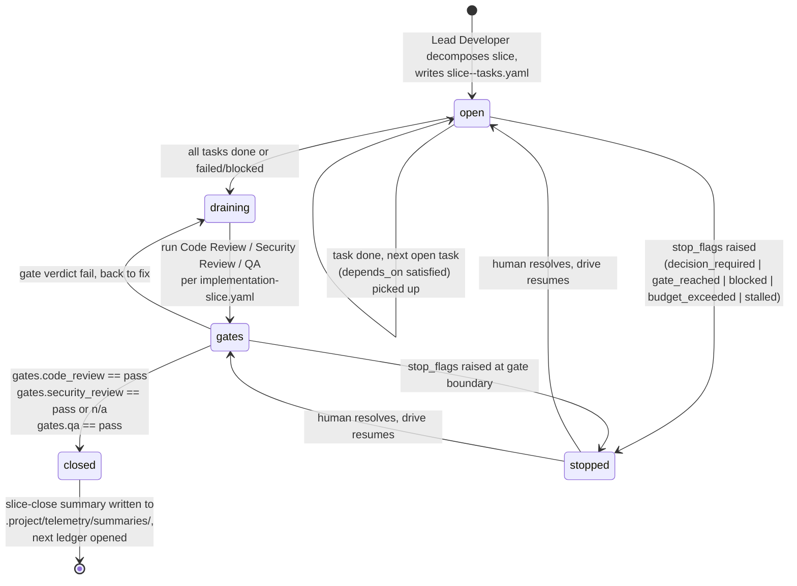

# The Operating Model

The big-picture page: how a user's intent turns into governed, evidence-based
delivery, and where drive mode fits as the loop that keeps things moving
between human touchpoints. Every box below names a real file, skill, or
agent in this repo — none of this is aspirational. For the phase-by-phase
prose walkthrough, see [`docs/lifecycle.md`](lifecycle.md); for the drive
loop specifically, see [`docs/autonomous-drive.md`](autonomous-drive.md).

## 1. Overall operating model

Drive mode doesn't replace the gate/human-approval boundary — it's the loop
arrow that repeatedly re-invokes the agent/skill/tier-routing step so a
slice can advance through multiple tasks without a human re-prompting each
one, and it hands control back to the human at every gate, decision point,
or budget stop per `governance/autonomy.yaml`.

**Workflow-drive is the outer ring around that loop.** Where drive mode
(above) loops a slice's *tasks*, `scripts/praxis-drive.sh --workflow` loops a
whole workflow's *phase steps*, one altitude up: `user → workflow-drive loops
phase steps (each launched on its phase-tier model, per
`skills/adaptive-model-routing`'s phase defaults) → within a C-phase step,
slice-drive loops tasks → specialists`. Its genuine unattended span is the
**C→D autonomy zone** only (implementation → release) — A (discovery) and B
(architecture) stay human-gated because that's where downstream exit
criteria are authored and frozen, and every `kind: gate` step is always a
human stop regardless of the dial. Opt-in via `--workflow`; schema and step
kinds in `references/phase-gates.md`, protocol in `skills/autonomous-drive`.

The 9 workflow files above are templates, not project plans — `delivery-planner`
instantiates each per-project (activating/deactivating branches by flag), and a
scenario only earns a new file when its gate topology differs; see
`skills/using-praxis/SKILL.md`'s Workflow composition policy.

## 2. The layer mental model

Commands are an optional entry point — a user can also address a workflow
directly through `using-praxis`'s Layer 1 routing without typing a slash
command. Every layer below commands is mandatory: workflows always resolve
to skills, skills are consumed by agent personas, and every agent spawn
resolves to a concrete model through the tier table, never a hardcoded model
name.

## 3. The drive loop sequence

The runner, not the agent, is what enforces iteration caps, run budgets,
stall detection, and the non-negotiable stops — see
`references/loop-contracts.md` §3 for the iteration protocol this diagram
summarizes and `docs/autonomous-drive.md` for what each exit code means in
practice.

## 4. Slice lifecycle (task ledger states)

`state` in the ledger tracks `open | draining | gates | closed`;
`stop_flags` is the drive runner's contract — non-empty means the loop halts
at the next task boundary regardless of which ledger `state` it's in.  Full
field semantics: `references/loop-contracts.md` §2.

## Cross-links

- [`docs/lifecycle.md`](lifecycle.md) — the six human-facing phases and the
  gates they close with.
- [`docs/autonomous-drive.md`](autonomous-drive.md) — the operator guide to
  the autonomy dial, run budgets, and troubleshooting drive-mode stops.
- [`docs/model-routing.md`](model-routing.md) — how the tier table in
  diagram 2 resolves to concrete models per harness.
- [`docs/telemetry.md`](telemetry.md) — the telemetry layers that back the
  drive loop's cost proxy and the routing report.
- `references/loop-contracts.md` — the loop contract and task ledger
  schemas referenced by diagrams 3 and 4.
- `references/phase-gates.md` — the workflow-step ledger schema, the
  phase-exit predicate registry, and the C→D autonomy zone that
  workflow-drive (diagram 1) reads.
- `skills/using-praxis/SKILL.md` — the front door and orchestration runtime
  referenced in diagram 1.
