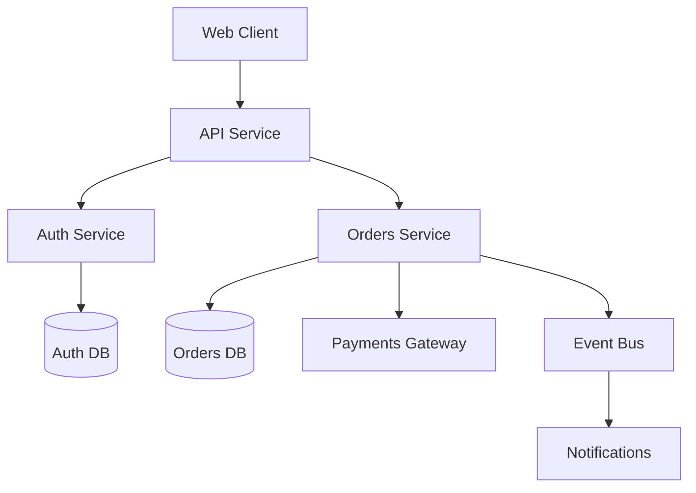

# Codebase Comprehension

<!-- praxis:metadata:begin -->
```yaml
capability: maintenance
domain: cross-cutting
state: active
dependencies:
 - project-memory
 - memory-management
triggers:
 - "starting work on an existing codebase (brownfield engagement)"
 - "onboarding a new agent to a codebase"
 - "refreshing .repo-intel/ after significant codebase changes"
 - "preparing for impact-analysis on a proposed change"
 - "auditing a codebase for technical-debt patterns"
outputs:
 - .repo-intel/architecture-map.md
 - .repo-intel/dependency-graph.{md,dot}
 - .repo-intel/service-map.md (for multi-service systems)
 - .repo-intel/ownership-map.md (from CODEOWNERS + commit history)
 - .repo-intel/hotspot-analysis.md (change frequency × complexity)
 - .repo-intel/conventions.md (inferred from the existing code)
 - .repo-intel/test-coverage-gaps.md
consumers:
 - solution-architect (uses architecture map and conventions)
 - all developer agents (use .repo-intel/ to ground brownfield work)
 - impact-analysis (reads dependency-graph and service-map)
 - legacy-modernization (reads hotspots and seams)
 - tech-debt-management (reads hotspots and conventions)
 - architecture-challenger (reads conventions to attack assumptions)
references: []
```
<!-- praxis:metadata:end -->

The platform's understanding of a codebase doesn't survive sessions or assistants unless we make it persistent. `.repo-intel/` is that persistence — a structured, agent-readable model of the codebase that every brownfield engagement consults and incrementally updates.

The principle: **look before you leap**. On brownfield, no change is made before this skill runs. The cost of comprehension is much smaller than the cost of changing code while ignorant of it.

## When this skill fires

- The orchestrator detects a brownfield engagement (codebase exists) and runs this skill as the first action.
- An agent (developer, reviewer) needs context on a codebase it hasn't worked in before. The agent reads `.repo-intel/`; if absent, runs this skill first.
- The codebase has changed significantly since the last comprehension pass (rule of thumb: 1000+ LOC changed, or major refactor). The Curator schedules a refresh.
- `impact-analysis` is about to run on a proposed change — it depends on `.repo-intel/` being current.

Greenfield engagements (empty repo) skip this skill. The orchestrator's mode detection (Section 6 of blueprint) makes that call.

## The comprehension procedure

### 1. Detect scope and tools

What language(s), framework(s), build system(s), test runner(s), CI system are in use? Read:

- Build manifests: `pom.xml`, `package.json`, `pyproject.toml`, `go.mod`, etc.
- Containerization: `Dockerfile`, `docker-compose.yaml`, `k8s/` directory.
- CI: `.github/workflows/`, `.gitlab-ci.yml`, `azure-pipelines.yml`.
- Documentation: `README.md`, `ARCHITECTURE.md`, `docs/`.
- IaC: `terraform/`, `pulumi/`, `bicep/`, `cdk/`.

Output the inventory at the top of `architecture-map.md`.

### 2. Map the architecture

Walk the directory tree. For each top-level source directory, identify:

- Its responsibility (bounded context, technical layer, infrastructure concern).
- Its entry points (how requests enter, how events arrive, scheduled jobs).
- Its external dependencies (databases, third-party APIs, internal services).
- Its outputs (HTTP, message queues, files, database mutations).

For a Spring Boot project, this is package layout × controllers × repositories × external clients. For a Node service, it's the route table × service classes × DB clients. For a microservices system, it's per-service.

Render the result as `.repo-intel/architecture-map.md` with a C4-ish container diagram. Use Mermaid or PlantUML inline:



### 3. Build the dependency graph

For each module/package/service, list its dependencies — internal (other modules) and external (libraries, services).

- Static analysis: use language-appropriate tools (`mvn dependency:tree`, `npm ls`, `pipdeptree`, `go list -m all`).
- Code-level imports: parse import statements per file; build the module-to-module graph.

Output:
- `.repo-intel/dependency-graph.md` — narrative + key clusters.
- `.repo-intel/dependency-graph.dot` (Graphviz) — for visualization.

Flag:
- **Circular dependencies** between modules.
- **God modules** depended on by many.
- **Outdated libraries** (deferred to `supply-chain-security` for security implications; here just note version drift).

### 4. Service map (for multi-service systems)

For systems with multiple deployable services:

- Service catalog: name, purpose, owner (if traceable), runtime.
- Inter-service communication: REST, gRPC, async via message bus.
- Shared infrastructure: databases, caches, queues each service touches.

Output to `.repo-intel/service-map.md`.

### 5. Ownership map

From `CODEOWNERS`, `OWNERS`, or commit history:

- Per-area (top-level directory or module), the top contributors and recent committers.
- Areas with no clear ownership (orphan modules) — these are tech-debt risk hotspots.

Output to `.repo-intel/ownership-map.md`. Useful for routing questions and changes to the right people (even in solo dev — knowing which areas were heavily authored by the principal vs. inherited from past hands).

### 6. Hotspot analysis

The intersection of **change frequency** and **complexity** is where bugs live. From git log + cyclomatic complexity:

- Files touched in many commits in the last 6–12 months.
- Files with high complexity per change.
- Files with many committers (high coordination overhead).

Output a ranked list in `.repo-intel/hotspot-analysis.md`. These are candidate refactoring targets (handed to that skill) and high-risk areas for changes (used by `impact-analysis`).

### 7. Convention inference

How does this codebase actually do things? Inferred, not declared:

- Naming conventions (snake_case vs camelCase per identifier kind).
- Layering conventions (where do controllers live? services? data access?).
- Error-handling patterns (exceptions? result types? error codes?).
- Logging patterns (structured vs string-based; which logger).
- Testing patterns (where are tests? what framework? mocking strategy?).
- DI / IoC patterns (constructor injection? field injection? service locator?).

Compare against `engineering-standards`. Output to `.repo-intel/conventions.md`:

```markdown
# Conventions (inferred)

## Naming
- Classes: PascalCase ✓ (matches house standard)
- Variables: snake_case in Python ✓
- Booleans: mixed — `is_active` and `isActive` both appear. **Inconsistency.**

## Error handling
- Mix of throwing and result-returning. Pattern unclear.
- **House standard recommends typed-exception approach.** Migration is not trivial; deferred to tech-debt-management.

## Tests
- pytest. Tests in `tests/` directory mirroring src layout. ✓
- Some fixtures in `conftest.py`; module-level setUp in some files. Inconsistent.
```

The brownfield mode of every G/B skill consults this output: match existing conventions where consistent, nudge toward the standard where inconsistent or absent.

### 8. Test coverage gaps

If coverage tooling is in use, capture the report. If not, identify:

- Modules with zero tests (high risk for changes).
- Critical paths with low coverage (correlate with hotspots).
- Tests that exist but don't test behavior (assertion-light tests; smoke tests passing as unit tests).

Output to `.repo-intel/test-coverage-gaps.md`. Drives:

- `testing-strategy` — what new tests to add.
- `impact-analysis` — what changes carry hidden risk because no test covers them.

## Incremental updates

`.repo-intel/` is incrementally maintained, not regenerated:

- On every PR merged into the codebase, the orchestrator can trigger a delta-update on the affected modules.
- On a scheduled cadence (weekly or monthly per project), a fuller refresh runs.
- The Curator triggers a comprehensive refresh after major refactors.

The `last_updated` timestamp at the top of each `.repo-intel/` file tracks freshness. Stale `.repo-intel/` is a yellow flag — agents proceeding against it should validate critical assumptions.

## What this skill does not do

- Modify code — purely read-only.
- Decide what to change — that's the agent consuming `.repo-intel/`.
- Run impact analysis on proposed changes — that's `impact-analysis`, which reads `.repo-intel/`.
- Manage tech debt — that's `tech-debt-management`, which reads `hotspot-analysis.md`.

## Output frontmatter

Each `.repo-intel/*.md` file carries frontmatter so `memory-management` indexes it:

```yaml
---
type: repo-intel
title: <name>
date: YYYY-MM-DD
generated_by: codebase-comprehension
last_full_refresh: YYYY-MM-DD
delta_updates_since: YYYY-MM-DD
tags: [architecture, dependency, ownership, hotspot, conventions, coverage]
---
```

## Common rationalizations

| The agent's thought | Counter |
|---|---|
| "I'll read the code as I go." | Reading-as-you-go means rediscovering the same things; missing cross-cutting patterns. Comprehend first. |
| "Documentation is the source of truth." | Documentation drifts. Code is what runs. Reconcile both. |
| "The team will explain it." | Team knowledge is partial + biased. Comprehension extracts what the code says. |
| "I'll only touch what I'm asked to touch." | Yes, but you still need to know what your change affects. Comprehension defines blast radius. |
| "Skim is enough." | Skim catches structure; not invariants, idioms, gotchas. Comprehension reads selectively for depth. |
| "Static analysis catches everything." | Catches what it's tuned for. Reading reveals what tools can't articulate. |

## Verification

You are done when:

- [ ] `.repo-intel/` populated with: system map (C4 Level 1+2), data flows, build+deploy story, runtime model, hot paths.
- [ ] Boundaries identified: services, modules, packages with public APIs.
- [ ] State stores enumerated (DBs, caches, queues, event buses).
- [ ] External dependencies catalogued.
- [ ] Build commands documented; environment requirements captured.
- [ ] Hot paths identified from logs/traces (where it spends most of its time).
- [ ] Critical idioms + gotchas captured.
- [ ] Open questions logged.

Evidence to check:
- A new joiner can read `.repo-intel/` and produce a non-trivial change.
- `architecture-documentation` reconciliation can consume the outputs.

## Anti-patterns

- Running comprehension once and never refreshing. The codebase moves; stale `.repo-intel/` is worse than none because it misleads.
- Treating inferred conventions as the *desired* state. They're the *current* state. Decide separately what to nudge toward.
- Ignoring `.repo-intel/` because "the codebase is small and I'll just read it." Then write that down — make the comprehension explicit even if quick. Future agents can't rely on what's only in your head.

## Mode handling

Brownfield-only. On a greenfield empty repo, this skill is a no-op that creates an empty `.repo-intel/` placeholder with a note: "Project is greenfield; comprehension will run when there is code to comprehend." Subsequent slices populate it as the codebase grows.
