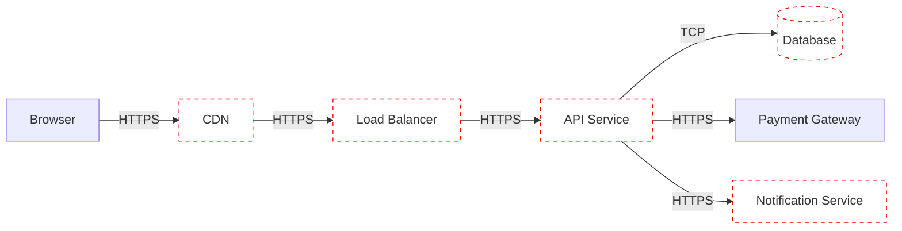

# Threat Modeling

<!-- praxis:metadata:begin -->
```yaml
capability: quality-and-security
domain: cross-cutting
state: active
dependencies:
  - architecture-pattern-selection
  - nfr-definition
  - secure-coding
triggers:
  - "designing the security posture for a new system"
  - "adding a new public-facing surface"
  - "adding a new integration (third-party, partner, internal cross-trust)"
  - "compliance regime requires documented threat models"
  - "Architecture Challenger's security sub-persona attacking a design"
outputs:
  - data-flow diagram with explicit trust boundaries
  - STRIDE enumeration per data-flow + entry point
  - prioritized threats (severity × likelihood)
  - mitigations per threat (mapped to NFRs and skills that implement them)
  - residual risks (accepted, with rationale)
consumers:
  - solution-architect (primary author at architecture time)
  - architecture-challenger (security sub-persona uses this skill)
  - security-reviewer (consumes for review baseline)
  - secure-coding (consumes for what to defend against)
  - compliance-privacy (uses for regime-required threat-modeling docs)
references: []
```
<!-- praxis:metadata:end -->

The discipline of asking, at design time, "how does this get broken?" Done well, threats are surfaced when fixes are cheap (architectural). Done poorly or skipped, threats surface in production via incidents that are 100x more expensive to fix.

The principle: **design assumes adversaries; threat modeling makes the assumptions explicit and mitigated.**

## When this skill fires

- A new substantial system is being designed — SA runs threat modeling alongside `architecture-pattern-selection`.
- A new public-facing surface is being added (new API; new portal; new integration partner).
- A new trust boundary is being introduced (a new internal service that calls existing services; a new ingest from a third-party).
- A compliance regime requires documented threat models (SOC2, ISO 27001, FedRAMP all expect some form).
- Architecture Challenger's security sub-persona attacks a design — this skill's outputs are the baseline.

## The procedure (lightweight, recurring)

A full threat-modeling session is ~60–90 minutes for a substantial design; ~15–30 minutes for a slice that extends an existing design.

### 1. Draw the data-flow diagram

The system's components, their data flows, and **explicit trust boundaries** between them. Plain whiteboarding works; Mermaid in markdown is fine; specialized tools (OWASP Threat Dragon, Microsoft Threat Modeling Tool) are useful for complex systems.



Trust boundaries are where authority changes:
- Browser → CDN (untrusted → semi-trusted edge)
- CDN → API (semi-trusted edge → trusted application)
- API → Database (trusted to trusted; still a boundary)
- API → Payment Gateway (trusted to external partner)

Every boundary is a place where authentication, authorization, validation, and audit must apply.

### 2. STRIDE per data flow / entry point

STRIDE is the canonical taxonomy. For each component and each data flow, ask:

| Letter | Threat | Defense category |
|---|---|---|
| **S** | Spoofing identity | Authentication |
| **T** | Tampering with data | Integrity (signing, validation) |
| **R** | Repudiation | Audit logging |
| **I** | Information disclosure | Confidentiality (encryption, authz) |
| **D** | Denial of service | Availability (rate limit, scaling, resilience) |
| **E** | Elevation of privilege | Authorization (least privilege) |

For each component, walk STRIDE:

```markdown
## Component: API Service

### S — Spoofing
- Threat: Attacker impersonates a user.
  Mitigation: OIDC + MFA; JWT signature verification; refresh-token rotation (per `authn-authz`).
- Threat: Attacker impersonates the payment gateway via DNS.
  Mitigation: Certificate pinning at the payment-API client; mTLS where supported.

### T — Tampering
- Threat: Attacker modifies request mid-transit.
  Mitigation: TLS 1.3; HSTS.
- Threat: Attacker modifies persisted order amount.
  Mitigation: Server-side authoritative pricing; client-supplied amount validated against catalog.

### R — Repudiation
- Threat: User claims they didn't place the order.
  Mitigation: Audit log every state change with userid, timestamp, request_id; immutable storage; retention per `compliance-privacy`.

### I — Information disclosure
- Threat: Cross-tenant data leak via missing tenant scope.
  Mitigation: Per `multi-tenancy` — tenant_id required in every query; RLS as defense in depth.
- Threat: PII in logs.
  Mitigation: Per `secure-coding` — log redaction at the boundary; no PII fields logged.

### D — Denial of service
- Threat: Attacker floods the API.
  Mitigation: Per-IP and per-tenant rate limits at ingress; CDN absorbing static; circuit breakers (per `resilience-patterns`).
- Threat: Resource-exhaustion via large payloads.
  Mitigation: Max payload size enforced; pagination required for list endpoints.

### E — Elevation of privilege
- Threat: User accesses another user's order via /orders/{id} (BOLA).
  Mitigation: Per `authn-authz` — object-level authorization check on every per-resource endpoint.
- Threat: Compromised internal service uses elevated identity to access prod data.
  Mitigation: Per `multi-tenancy` + service mesh — workload identity scoped to minimum-required permissions.
```

This is the *bulk* of the threat model. Per component, walk STRIDE. Most projects find 20–40 threats; many already mitigated; a few new.

### 3. Prioritize by severity × likelihood

Each threat gets:

- **Severity** (if exploited, how bad): blocker / major / minor / nit.
- **Likelihood** (how readily exploited): high / medium / low.

The combination drives prioritization. A blocker × high becomes a must-fix; minor × low can be accepted (residual risk recorded).

### 4. Map mitigations to skills

Every accepted mitigation maps to one or more skills that implement it:

```
Threat: BOLA on /orders/{id}
Mitigation: Object-level authz check.
Implemented by: `authn-authz` (model) + `secure-coding` (review checklist).
Verified by: `code-review` checklist + automated tests covering cross-user access denial.
```

The threat model is the *spec* the security-bearing skills implement.

### 5. Document residual risks

Accepted risks (couldn't / chose not to mitigate fully) are documented:

```
Risk: Payment Gateway is a third-party SaaS; an outage there causes order placement failure.
Severity: blocker if extended; major routinely.
Mitigation accepted: queue + retry per `resilience-patterns`; status page communication.
Residual: short outages still cause user-visible failures.
Accepted by: SA + PM per architecture-sign-off ADR.
```

Residual risks become part of the system's known operational reality.

### 6. Review and revise

Threat models are **living documents**. Revisit:

- When a new substantial design is introduced.
- When a slice adds new trust boundaries.
- When incidents (per `incident-runbook`) surface threats that weren't modeled.
- Quarterly for active production systems.

## Outputs

| Output | Location |
|---|---|
| Data-flow diagram | `.project/operational/threat-model-{system}.md` |
| STRIDE enumeration | inline in same |
| Prioritized threats | same |
| Mitigations + owners | same; cross-referenced to implementing skills |
| Residual risks | `.project/operational/risk-acceptances/` |

## How this integrates with other skills

| Skill | How it consumes threat model |
|---|---|
| `architecture-challenger` (security sub-persona) | Reads the threat model; attacks gaps; finds missed STRIDE entries. |
| `secure-coding` | Implements the per-component defenses; review checklist verifies coverage. |
| `security-reviewer` | Audits PRs for new threats / mitigations against the model. |
| `authn-authz` | Reads identity-related STRIDE threats (S + E primarily) for design decisions. |
| `multi-tenancy` | Reads cross-tenant I + E threats for isolation design. |
| `compliance-privacy` | Uses the threat model as required documentation for SOC2 / ISO 27001 / FedRAMP. |

## Mode handling (G/B)

**Greenfield.** Build threat model alongside the architecture; iterate during design.

**Brownfield.** Reconstruct the model from the existing system's behavior. Common findings: trust boundaries undocumented; threats addressed in some components and ignored in others; residual risks accumulated without explicit acceptance.

## What this skill does not do

- Implement defenses — that's `secure-coding`, `authn-authz`, `multi-tenancy`.
- Penetration testing — separate practice.
- Code-level security review — that's `secure-coding` + `code-review`.
- Compliance attestation — that's `compliance-privacy` (which uses this skill's output as evidence).

## Common rationalizations

| The agent's thought | Counter |
|---|---|
| "OWASP at code time is enough." | OWASP catches code-level vulnerabilities; STRIDE catches architecture-level ones. They're complementary, not alternatives. |
| "We're internal-only; no real threat model needed." | Insider threats are 30%+ of incidents. Trust boundaries still exist inside a single org. |
| "Threat modeling slows us down." | Production incidents from missed threats slow you down more. Front-load the cost. |
| "The framework handles security." | Frameworks handle some classes (CSRF tokens, SQL escaping). They don't handle business-logic abuse, IDOR, or trust boundaries. |
| "We'll threat-model post-MVP." | MVPs ship to production and accumulate users. Threat modeling at MVP is far cheaper than after. |

## Verification

You are done when:

- [ ] STRIDE walk completed for each trust boundary identified.
- [ ] Trust-boundary diagram exists at `.project/working/architecture/trust-boundaries.md`.
- [ ] Data flows across boundaries enumerated (what data, classification, protection in-transit, authz).
- [ ] Per-threat: mitigation OR accepted-risk-with-rationale (no silent ignores).
- [ ] Accepted risks logged to `.project/operational/risk-acceptances/` with conditions + review date.
- [ ] At least one threat per STRIDE category surfaced (S/T/R/I/D/E).
- [ ] Threat model file linked from the architecture overview.
- [ ] Threat model is updated as architecture evolves (per `architecture-documentation` reconciliation).

Evidence to check:
- Security Reviewer can audit the threat model end-to-end.
- The model can be re-walked post-incident to verify the threat WAS or WASN'T modeled.
- For regulated regimes: the threat model satisfies the regime's threat-modeling control.

## Anti-patterns

- Threat modeling as a one-time architecture-phase exercise (then never revisited).
- STRIDE walked through but mitigations never assigned owners.
- Threat models without prioritization (every threat looks equal).
- Residual risks not documented (accumulated unknowingly).
- Threat models stored in slides, not in `.project/`.
- "We did threat modeling" with no diagram, no enumeration, no specific threats.
- Trust boundaries assumed identical to network boundaries (they're not — TLS doesn't make internal identity-bearing calls trustworthy without identity).
- Compliance-driven threat models without practical use (paperwork; not a living artifact).
